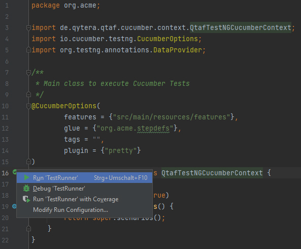
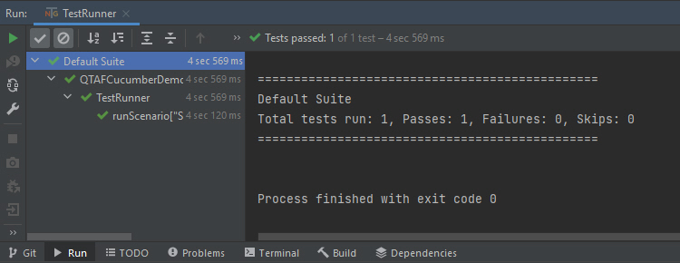

# QTAF Cucumber Demo Project

## How to run this project

Clone this repository to your computer and open it with the IntelliJ IDE.
Open the `TestRunner` class file and execute the class by clicking the green arrow left to the class name.

Now the tests should be executed. The results should look similar to this:

